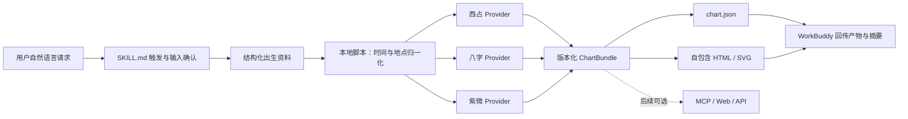

# 三体系命盘 Skill：Qoder 项目交接与冷启动说明

> 更新日期：2026-07-21
>
> 项目暂定名：Ming Engine（可随时更名）
>
> 目标：交付一个可导入腾讯 WorkBuddy、兼容主流 `SKILL.md + scripts` 生态的本地 Skill，稳定计算西方占星本命盘、八字和紫微斗数，并按需生成结构化 JSON 与可预览的 HTML/SVG 命盘报告。

## 0. 一句话决策

项目形态改为 **Skill-first**，但不要把公式写成提示词。Skill 负责识别请求、收集并确认输入、调用其自带的确定性脚本、解释警告和回传产物；脚本负责版本化、可回归验证的排盘。大模型只作为 Skill 的编排与可选表达层，不能参与行星位置、历法转换、干支、宫位或星曜安置等基础计算。

第一版只交付一个主 Skill：`calculate-birth-charts`。它同时支持西占、八字、紫微及三盘合算，避免多个 Skill 互相抢触发。未来若增加自然语言深度解读，再单独建立 `interpret-birth-charts`，让“计算”和“解读”在安装、授权和依赖上彻底分离。

默认按“未来可能闭源商用”设计：优先采用许可清晰的 MIT/BSD/Apache 依赖，所有第三方代码和数据来源做许可证清单；任何 AGPL/GPL 或来源不清的代码在得到项目所有者明确同意前不得引入。

## 1. 产品目标与边界

### 1.1 核心目标

用户输入：

- 出生日期；
- 出生当地时间，以及时间精度（准确、约数、未知）；
- 出生地点，最终必须解析为经纬度与 IANA 时区；
- 性别规则输入（仅用于确实依赖该字段的八字/紫微规则，并在界面解释用途）；
- 阳历/农历、是否闰月；
- 可选的流派和算法设置。

系统输出：

- 西方占星：行星、角点、宫位、相位、逆行等结构化结果，并可绘制圆盘；
- 八字：四柱、藏干、十神、纳音、旺衰所需的基础量、起运与大运/流年等结构化结果；
- 紫微斗数：十二宫、主辅杂曜、四化、亮度/庙旺配置、三方四正、大小限和流年/月/日/时等结构化结果；
- 每项结果携带算法、规则集、依赖版本、时区与真太阳时策略、警告和计算追踪信息；
- JSON 导出/导入与可复现计算；
- Skill 在当前工作区生成脱敏友好的 `chart.json` 与自包含 `chart-report.html`/SVG，WorkBuddy 可直接预览产物。

以上是长期能力目标。第一版必须收口为：西占只做本命盘；八字做四柱、藏干、十神、纳音、起运和大运等可确定结构，不做无来源的格局/喜用神结论；紫微先做本命十二宫和大限，流月、流日、流时等动态盘放到后续。三体系统一计算的首个保证区间暂定 `1901-2100`，单个 provider 即使声称支持更宽年份，也只能在独立验证后扩大并写入 capabilities。

### 1.2 非目标

- 第一版不做“根据人生事件反推出生时辰”。生时校正应是后续独立的概率型模块，不能混进基础排盘。
- 第一版不做账户、支付、数据库、云 API、常驻 Web 服务或云端出生档案；Skill 直接调用本地打包脚本。独立网页和 MCP 都是后续兼容入口，不再是第一版主形态。
- 姓名、职业、情感经历等个人资料不应改变基础命盘；它们只可在用户明确授权后用于解释或报告。
- 第一版不宣称预测具有科学验证。产品文案应表述为传统文化、娱乐或自我反思用途，不应用于医疗、法律、投资等重大决策。
- 不让 LLM 自己补算缺失星位、节气、干支或星曜；缺失就返回明确错误/警告。

## 2. 现成项目调研结论

### 2.1 接近完整产品的项目

| 项目 | 可取之处 | 风险与建议 |
|---|---|---|
| [Taibu](https://github.com/hhszzzz/taibu) | 已覆盖八字、紫微、西占、Web 和 MCP；其分包架构很适合参考；`taibu-core` 和 MCP 相关包标为 MIT | Web/服务端其余部分是 AGPL；西占上游使用较老的 CircularNatalHoroscopeJS；真太阳时逻辑不够全球化。只把 MIT 分包与架构当参考，禁止直接复制 AGPL 部分到闭源产品 |
| [Mingyu](https://github.com/Brhiza/mingyu) | 产品形态和本项目高度相似，有 Web、API、OpenAPI、MCP、Skill；公开 API 的八字、紫微和西占接口已做过基本冒烟验证 | 项目较新；根仓库许可证标识不够清晰，虽然 `mingyu-core` 包元数据写 MIT。适合作为交互/API 参考和对照样本，不应成为唯一可信计算源 |
| [Suangua](https://github.com/Sudo-Biao/suangua) | 展示了 LLM/RAG 与命理产品组合方式 | 提交和维护证据太少，许可证识别也不稳定，不作为底座 |

### 2.2 推荐的分体系基础库

| 体系 | 默认候选 | 结论 |
|---|---|---|
| 西方占星 | [Celestine](https://github.com/Anonyfox/celestine) | MIT、TypeScript、适合闭源友好 MVP，但项目新，必须用 Swiss/JPL 做自己的黄金回归；必须包在 provider 接口后面，随时可替换 |
| 西方占星高精度长期方案 | [Swiss Ephemeris](https://github.com/aloistr/swisseph) | 行业常用低层天文历算，但为 AGPL/商业双许可；闭源线上服务必须先完成许可决策，不能因为是 SaaS 就假设规避 AGPL |
| 西方天文独立校验/替代底座 | [Astronomy Engine](https://github.com/cosinekitty/astronomy) | MIT、跨语言、公开与 JPL/NOVAS/Horizons 校验；但不直接提供完整占星宫位/相位/尊贵等领域层 |
| 八字/历法 | [Tyme4TS](https://github.com/6tail/tyme4ts) | MIT、活跃，是推荐主底座；仍需自行处理 IANA 历史时区、真太阳时、流派配置和独立测试 |
| 八字成熟对照 | [Lunar JavaScript](https://github.com/6tail/lunar-javascript) | MIT、成熟；官方已转入只修 bug、建议迁移 Tyme。可用于迁移与对照，但它明确不替调用方处理真太阳时和时区 |
| 紫微斗数 | [iztro](https://github.com/SylarLong/iztro) | MIT、生态和功能最完整，支持配置/插件处理部分流派差异，是第一选择；地点、时区和真太阳时仍须在外层预处理 |

许可证特别注意：

- [Kerykeion](https://github.com/g-battaglia/kerykeion)、Immanuel、PySwissEph 等可用于 AGPL 项目或获得相应许可后的路线，不默认进入闭源友好版本。
- 顶层包写 MIT 不代表所有上游代码、算法表和数据都自动没有义务。尤其历法项目对“寿星天文历”等资料的来源说明，需要在商用前做一次人工法律/来源审计。
- 以上不是法律意见；Qoder 必须生成 `THIRD_PARTY_NOTICES.md` 和 `docs/LICENSE_AUDIT.md`，记录“代码许可、数据许可、传递依赖、核验日期、链接、采用决定”。
- 安装任何依赖前重新核验当时的仓库 LICENSE 与包发布元数据，不凭这份文档中的历史状态盲装。

### 2.3 权威资料与校验入口

- 西方天文位置：[JPL Horizons](https://ssd.jpl.nasa.gov/horizons/)；[Swiss Ephemeris programmer documentation](https://www.astro.com/swisseph/swephprg.pdf)。
- 时区：[IANA Time Zone Database](https://www.iana.org/time-zones)。
- 中国历法国家标准：[GB/T 33661-2017《农历的编算和颁行》](https://openstd.samr.gov.cn/bzgk/std/newGbInfo?hcno=E107EA4DE9725EDF819F33C60A44B296)。该标准定义历法和二十四节气相关内容，不定义格局、喜用神等八字解释规则。
- 中国历法人工对照：[香港天文台年历](https://www.hko.gov.hk/sc/gts/astron2026/almanac2026_index.htm)。
- 八字规则资料：优先使用版权已明确的古籍原文和可授权资料，如《渊海子平》《三命通会》《子平真诠》《穷通宝鉴》《滴天髓》；不要复制现代网站或书籍的大段解释文案。
- 紫微规则资料：《紫微斗数全书》及明确标注流派、版本、授权状态的规则资料。不能把某个库的默认值包装成“唯一正统”。

## 3. 推荐技术方案

### 3.1 技术栈

- 源码使用 TypeScript 严格模式、Node 当前 LTS、pnpm workspace；
- Skill 发布物包含已经打包的 ESM 脚本和所需数据，安装后不应临时执行 `npm install`，也不应要求用户启动数据库或后台服务；
- `SKILL.md` 只保留触发、输入确认、脚本调用、错误处理和结果呈现流程，控制在 500 行以内；算法资料、schema 和流派说明按需放入一层 `references/`；
- 输入/输出契约使用 Zod，并生成 JSON Schema；
- 单元、属性、黄金样例和 Skill 集成测试使用 Vitest；产物预览用自包含 HTML + SVG，不把 React/Next.js 作为第一版依赖；
- pnpm 只用于开发和构建。发行前将引擎 bundle 到 Skill 内并在无源码 workspace 的干净目录中验证；
- 可选 MCP、独立 Web 和 REST API 在主 Skill稳定后通过相同引擎增加，不能成为 Skill 运行前置条件。

具体框架版本是时效信息，Qoder 在开工时查当前稳定版、兼容矩阵和许可证后锁定，并用 ADR 记录。

### 3.2 推荐目录

```text
skills/
  calculate-birth-charts/
    SKILL.md                         # 只有 name/description frontmatter + 精简工作流
    agents/
      openai.yaml                    # 跨 Codex 生态的 UI 元数据；与 SKILL.md 保持一致
    scripts/
      ming-chart.mjs                 # 唯一稳定 CLI：doctor/normalize/calculate/compare/render/verify
      dist/
        engine.mjs                   # 构建产生的确定性引擎 bundle
      fixtures/
        smoke.json                   # 纯虚构的安装后自检样例
    references/
      input-contract.md
      output-contract.md
      rulesets.md
      sources-and-limitations.md
      privacy.md
    assets/
      report-template.html
    LICENSE
    THIRD_PARTY_NOTICES.md
    sbom.cdx.json
packages/
  contracts/           # Zod schema、错误码、版本化 JSON 契约
  time-location/       # 地点、IANA 时区、DST、UTC、真太阳时
  western/             # 西占领域模型与 provider adapter
  bazi/                # 八字领域模型与 provider adapter
  ziwei/               # 紫微领域模型与 provider adapter
  orchestrator/        # 一次计算三套盘、合并元数据和警告
  rules/               # 版本化规则配置，不放散乱 if/else
  test-fixtures/       # 有来源的黄金样例、边界样例和生成脚本
tools/
  build-skill.ts       # 将 packages 打包进可独立安装的 Skill
  validate-skill.ts    # 结构、frontmatter、权限、无网络和可移植性检查
docs/
  PRODUCT_SPEC.md
  ARCHITECTURE.md
  RULESETS.md
  VALIDATION.md
  LICENSE_AUDIT.md
  PRIVACY.md
  WORKBUDDY.md
  adr/
```

### 3.3 依赖方向



强制约束：

- `SKILL.md` 不得包含或模拟排盘公式；它必须调用 `scripts/` 的确定性入口；
- Skill 默认不联网、不上传出生信息、不调用 LLM API；需要在线地理编码时必须单独授权并允许手工经纬度/IANA 时区完全替代；
- 发布包必须自包含，不能通过指向仓库外部 `packages/` 的相对路径假装可安装；
- Web、API、MCP 若后续增加，必须与 Skill 调用同一引擎；
- 未来的 `interpret-birth-charts` 可以依赖结构化盘面，任何计算包不得反向依赖它；
- 第三方库类型不得直接成为公共 API；每个库必须通过自己的 adapter 转成项目契约；
- 任何自动 fallback 都必须出现在 `warnings`，尤其是宫制、时区、真太阳时和未知出生时间。
- 真太阳时只作为八字/紫微的可选流派输入，绝不能替换西方星盘所需的 UTC instant 与经纬度。

## 4. 最关键的领域设计：时间与地点

很多项目不是错在干支或星曜公式，而是错在输入时间。一个可用引擎必须保留以下过程：

1. 原始当地民用日期和时间；
2. IANA 时区（例如 `Asia/Shanghai`，不能只存 `UTC+8`）；
3. 当地时间在历史 DST 下是否唯一。遇到“重复时间”或“不存在时间”必须要求明确选择，不能静默猜测；
4. 转换后的 UTC instant；
5. 出生地经纬度和来源；
6. 平太阳时/视太阳时策略及方程时修正；不能把中国东八区中央经线 120°E 的简式硬套到全球；
7. 使用的 tzdb/运行时数据版本；
8. 如果时间精度不足或跨越节气、日界、时辰、宫头等边界，要返回多候选结果或显著警告。

Phase 0 必须用技术 spike 决定如何让 Node 与浏览器使用一致且可记录版本的 TZDB；不能默认依赖两台设备各自不同的系统时区数据。重复当地时间应保存用户选定的 `earlier/later`（或等价 `fold`）消歧策略；不存在的当地时间应返回结构化错误。

建议输入契约至少包含：

```ts
type BirthInput = {
  calendar: 'gregorian' | 'lunar';
  localDate: string;             // YYYY-MM-DD
  localTime?: string;            // HH:mm:ss；未知可省略
  timeAccuracy: 'exact' | 'approximate' | 'unknown';
  timezone: string;              // IANA zone
  location: {
    displayName?: string;
    latitude: number;
    longitude: number;
    elevationMeters?: number;
    source: 'user' | 'geocoder' | 'import';
  };
  lunarLeapMonth?: boolean;
  ruleGender?: 'male' | 'female' | 'unspecified';
  settings: CalculationSettings;
};
```

不要用 JavaScript `Date` 作为 JSON 公共契约；对外使用带 offset/zone 的 ISO 字符串和明确的 UTC instant。地名搜索只负责候选地点，最终计算依赖用户确认的经纬度和时区。

## 5. 规则集与默认行为

“流派不同”不能通过散乱布尔值解决。每次计算都选用带版本的 `rulesetId`，并在输出中原样记录。

### 5.1 西方占星

建议默认：热带黄道、地心、Placidus 宫制；同时至少支持 Whole Sign。高纬度下某些宫制无法计算时不得静默换宫制，应返回可操作的警告并让用户选择。

需显式配置：

- tropical/sidereal 及 ayanamsha（若做恒星黄道）；
- house system；
- 交点是真/平；
- 相位集合与 orb；
- 小行星、Lilith 等可选点；
- ephemeris/provider 与版本。

### 5.2 八字

至少把以下争议点版本化：

- 年柱和月柱的节气边界；
- 当地民用时、平太阳时或视太阳时；
- 日界在 00:00 还是采用早/晚子时规则；
- 子初换日的具体策略；
- 大运顺逆；
- 起运算法及精度；
- 是否按指定流派生成格局、强弱、喜用神。

MVP 先把可客观复现的历法与结构结果做准。格局、强弱和喜用神属于解释规则，必须标明规则来源和版本；不要生成一个没有来源的“唯一答案”。

### 5.3 紫微斗数

先以 iztro 默认算法形成一个明确命名的规则集，如 `iztro-default@具体版本`，再通过插件/配置增加流派。必须记录：

- 安星法/规则集 ID；
- 四化表版本；
- 星曜亮度表版本；
- 真太阳时是否应用；
- 大限/小限/动态盘配置。

“库支持插件”不等于“所有流派已经实现”。界面只能展示实际完成并有测试的规则集。

## 6. 公共输出契约

不要为了“统一”而把三套体系压成同一种抽象。统一的是元数据、错误、版本和调用方式；每套盘保留清楚的领域 schema。

```ts
type ChartBundle = {
  schemaVersion: string;
  engineVersion: string;
  requestId: string;
  calculatedAt: string;
  originalInput: BirthInput;
  normalizedTime: {
    localCivil: string;
    timezone: string;
    utcInstant: string;
    meanSolarTime?: string;
    apparentSolarTime?: string;
    timezoneDataVersion?: string;
    ambiguityResolution?: string;
  };
  western?: WesternChartResult;
  bazi?: BaziChartResult;
  ziwei?: ZiweiChartResult;
  warnings: EngineWarning[];
  provenance: {
    providers: Array<{ id: string; version: string; license: string }>;
    rulesets: Array<{ id: string; version: string }>;
  };
};
```

错误至少区分：输入校验失败、当地时间歧义、当地时间不存在、日期超出支持范围、缺少坐标、所选宫制在纬度下不可用、provider 失败、规则不支持。不要把所有失败都转成 HTTP 500。

## 7. Skill 产品形态、报告与兼容入口

### 7.1 主 Skill

第一版只发布 `calculate-birth-charts`。建议 frontmatter：

```yaml
---
name: calculate-birth-charts
description: Calculate deterministic Western natal charts, Four Pillars/BaZi, and Zi Wei Dou Shu charts from birth date, local time, IANA timezone, coordinates, calendar, and versioned rule profiles. Use when users ask to 排盘、算星盘、四柱八字、紫微斗数、比较真太阳时或流派差异、导出结构化命盘或 HTML/SVG 报告. Do not use for ungrounded predictive life advice.
---
```

YAML frontmatter 只写 `name` 和 `description`。触发条件必须尽量完整地放进 `description`；正文不要再写一大段“何时触发”。若生成 `agents/openai.yaml`，先读取目标生态的官方字段规范，它只承载 UI 名称、简介和默认提示，并与 SKILL.md 一致，禁止猜测额外字段。

Skill 的标准工作流：

1. 判断用户要西占、八字、紫微还是三盘合算，以及要 JSON、HTML 报告还是对话摘要；
2. 只收集计算必需字段，不要求姓名和人生经历；
3. 向用户复述当地时间、地点、经纬度、IANA 时区、历法/闰月、规则性别和 ruleset。遇到 DST 歧义、近似时间或跨边界风险必须确认；
4. 先运行 `ming-chart.mjs doctor`，再调用同一 CLI 的 `normalize` 与 `calculate` 子命令；需要可视化时再运行 `render`；
5. 检查退出码、JSON schema、warnings 与 provenance。脚本失败时返回错误，不让模型补算；
6. 对话只给简洁事实摘要，并把完整 JSON/HTML/SVG 作为工作区产物；
7. 默认不做吉凶预测。若未来安装了单独的解释 Skill，只把脱敏后的 `ChartBundle` 交给它。

建议稳定 CLI：

```text
node scripts/ming-chart.mjs doctor --json
node scripts/ming-chart.mjs normalize --input-file birth-input.json --output-file normalized.json
node scripts/ming-chart.mjs calculate --input-file birth-input.json --systems all --output-file chart.json
node scripts/ming-chart.mjs compare --input-file birth-input.json --profiles profile-a,profile-b --output-file comparison.json
node scripts/ming-chart.mjs render --input-file chart.json --output-file chart-report.html
node scripts/ming-chart.mjs verify
```

参数必须通过安全的参数数组或文件传递，禁止把用户文本拼接成 shell 命令。临时输入存放在当前工作区的私有临时目录，成功/失败后清理；只有用户要求保存的 JSON/HTML 报告作为产物保留。

### 7.2 HTML/SVG 报告代替第一版 Web App

- Skill 生成一个无外部 CDN、无远程字体、无追踪脚本的自包含 HTML；
- 报告包含西占圆盘、八字表、紫微十二宫、规则版本、warnings 和可折叠 JSON；
- 未知时间时，不伪造上升、宫位、时柱或紫微时辰结果；
- 报告只消费 `ChartBundle`，不得包含第二套计算代码；
- Qoder 必须实测 WorkBuddy 的 HTML 产物预览；若当前版本不支持完整交互，则同时输出 SVG/PNG 和 JSON，而不是引入服务器。

### 7.3 MCP、独立网页与 API

WorkBuddy 当前文档同时支持 `Skill + CLI` 和 `MCP + CLI`。本项目第一版采用前者，因此不需要先维护 MCP 服务。只有当其他智能体宿主不能运行本地 Skill、需要长期服务或远程调用时，再增加以下兼容层：

- 本地 stdio MCP；
- 读取同一 `ChartBundle` 的独立静态网页；
- 无状态 REST/OpenAPI；
- 需要鉴权、限流和脱敏日志的远程 Streamable HTTP MCP。

兼容层不得改变任何计算结果。对同一 input、ruleset 和依赖版本，Skill CLI、未来 Web/API/MCP 的规范化输出必须一致。

参考 WorkBuddy 官方资料：

- [WorkBuddy Overview](https://www.workbuddy.cn/docs/workbuddy/Overview)
- [Skills Market](https://www.workbuddy.cn/docs/workbuddy/From-Beginner-to-Expert-Guide/Function-Description/Skills-Market)
- [Connector](https://www.workbuddy.cn/docs/workbuddy/From-Beginner-to-Expert-Guide/Function-Description/Connector)

## 8. LLM 应该放在哪里

基础计算不需要任何基座大模型。推荐分三层：

1. **事实层**：确定性引擎输出“太阳在何宫、四柱是什么、哪颗星在哪个宫”等事实；
2. **规则解释层**：版本化规则把结构化事实变成可追踪的解释片段，并返回规则 ID/资料来源；
3. **LLM 表达层（可选）**：将已计算事实和已检索资料组织成自然语言、问答或报告。

LLM 的强制护栏：

- 只能读取计算结果，不能改写数值或补算；
- 每个重要结论尽量引用具体 chart fact 和规则 ID；
- 不确定、流派冲突或资料不足时明确说明；
- 不对医疗、法律、投资、生死等给确定性结论；
- 个人经历只在明确同意后发送；支持完全无 LLM 的离线模式；
- RAG 资料必须记录版权/授权来源，不把抓来的现代文章直接塞进知识库。

## 9. 验证策略

测试的目标不是证明命理预测科学有效，而是证明“给定输入与规则集，计算结果稳定、符合该规则、来源可追溯”。

### 9.1 必测边界

- 立春和十二节气交界前后至少 ±120 秒；
- 23:00、00:00 以及不同子时换日策略；
- 闰月、农历/公历双向转换；
- 两种或更多起运算法、大运顺逆；
- 北京、成都、乌鲁木齐、拉萨，以及不同时区的真太阳时；
- 历史 DST 的重复/缺失当地时间、国际日期变更线；
- 高纬度下 Placidus 等宫制失败；
- 行星换座、宫头、相位 orb、逆行驻点边界；
- 未知出生时间和近似时间；
- 相同输入、相同版本在源码 CLI 与独立安装后的 Skill 中得到相同 canonical JSON；未来增加 Web/MCP 时也必须一致。

### 9.2 黄金样例要求

- 每个 fixture 包含来源 URL/书目、采集日期、规则集、预期结果、允许误差和为何可信；
- 西占数值至少选一组用 JPL/Swiss 的独立结果校验；
- 闭源友好的 MIT 西占 MVP 在声明年份范围内，主要天体位置应以“不高于 1 角分误差”为初始门槛；换座、换宫等离散分类必须一致。若做 Swiss 商业路线，再单独制定更高精度门槛；
- 八字/紫微不能拿多个共享同一底层库的包装项目互相对照，然后声称“独立验证”；
- snapshot 只能防回归，不能自动成为真值；
- 初版最低建议：时间地点边界 30 例、西占 20 例、八字 40 例、紫微 20 例；之后每发现一个线上 bug 就增加对应 fixture。

CI 最低门槛（长期目标）分两档，避免“声明的门禁”与“实际强制的门禁”脱节：

- **当前阶段已强制**：`.github/workflows/verify.yml` 在 push/PR 上运行 `pnpm run verify:cloud`；它覆盖 format、lint、typecheck、unit/property/integration、build、host candidate 包、安装清单、依赖漏洞与通用 secret 扫描。CI 不接触事故专用 token。
- **受控本地全量门禁**：`pnpm run verify:all` = `verify:cloud` + `scan:incident`。后者的 token 文件是 gitignored 私密输入，缺失必须 fail-closed，绝不能以 CI secret、日志或仓库文件的形式补齐。发布或改变仓库可见性前还须运行 `pnpm run scan:incident:history`。
- **仍延后**：依赖许可证策略、SPDX 格式 SBOM，以及超出模板 CSP 检查的专项 HTML/XSS 安全测试；它们在有可运行门禁前不得写成已强制。

触发测试既要覆盖“排星盘/八字/紫微”，也要验证“销售星盘图、数据星盘图”等非出生命盘语境不会误触发。关键计算包不得用“降低覆盖率阈值”掩盖缺测。

## 10. 隐私、安全和可运维性

- 出生时间、地点和姓名属于敏感个人资料；默认本地计算或无状态服务；
- Skill 默认声明并遵守“本地文件执行、无网络、无遥测”的最小权限；在线地理编码必须单独征得同意；
- 日志不写完整请求体，不把姓名、精确时间、精确坐标写入 analytics；
- 提供删除、导出和无账户模式；
- 公开 API 做输入限制、速率限制、CORS、CSP 和依赖漏洞检查；
- 每次输出记录可复现版本，但不要把原始 PII 放进可公开分享的 URL；
- 分享盘面时默认生成脱敏副本；
- 错误监控只记录错误码、版本和粗粒度环境信息。
- HTML/SVG 对所有用户输入做转义，并使用严格 CSP；Skill 内所有路径相对自身或当前工作区解析，禁止硬编码开发机绝对路径。

## 11. 实施里程碑与完成定义

### Phase 0：设计冻结与风险核验

交付：产品说明、Skill 架构、输入输出 schema 草案、规则集矩阵、许可证审计、ADR、风险表，初始化 `skills/calculate-birth-charts`，以及三个候选 provider 在 Node 中的最小调用 spike。

完成条件：所有核心依赖的许可证与传递依赖已核验；闭源友好默认路线明确；TZDB 方案已通过 ADR 固定；Skill frontmatter/目录通过校验；没有开始复制来源不清代码。

### Phase 1：时间地点与公共契约

交付：`contracts`、`time-location`、错误模型、`normalize-birth` CLI 与测试夹具。

完成条件：DST 歧义/不存在时间、UTC、经纬度、真太阳时策略和版本元数据可测试；30 个边界样例通过。

### Phase 2：三套确定性 adapter

交付：Celestine（或经 ADR 选择的西占 provider）、Tyme4TS、iztro adapter；`calculate_all`。

完成条件：第三方类型未泄漏；所有结果带 provider/ruleset 版本；最低黄金样例通过；没有 LLM 依赖。

### Phase 3：可安装 Skill 与自包含脚本

交付：精简 `SKILL.md`、`agents/openai.yaml`、带 doctor/normalize/calculate/compare/render/verify 子命令的单一稳定 CLI、按需 references、构建与 Skill 验证脚本，以及不依赖源码 workspace 的发行目录。

完成条件：在一个只含 Skill 发布物的干净临时目录里可完成三盘计算；不运行 `npm install`；断网可用；未知/近似时间正确降级；使用独立新会话做至少三种真实请求的 forward test。

### Phase 4：HTML/SVG 报告与 WorkBuddy 实机验收

交付：自包含 HTML/SVG 报告、本地 Skill 安装包、WorkBuddy 上传/启用说明和脱敏的端到端示例。

完成条件：WorkBuddy 能从自然语言请求触发 Skill、确认输入、运行脚本并返回三盘摘要、`chart.json` 和可预览报告；安装安全扫描无未解释高风险；计算期间无隐式网络请求。

### Phase 5：兼容入口或解释 Skill（可选，二选一按需求推进）

交付：本地 stdio MCP/独立 Web/API 兼容层，或者独立 `interpret-birth-charts` Skill、资料来源与授权边界。

完成条件：所有兼容入口复用同一引擎；若做解释 Skill，卸载/关闭它后计算 Skill 仍完整可用，且解释可回溯到 chart facts。

### Phase 6：发行加固

交付：可重复构建的 Skill 包、校验和、SPDX SBOM、第三方声明、权限/网络审计、性能基准、版本与升级说明。

完成条件：全新 WorkBuddy 环境可从本地 Skill 包安装；CI 全绿；无未解释高危项；同一 fixture 在源码 CLI 与发布 Skill 中结果一致。

## 12. Qoder 执行规则

- 先读本文件，再检查仓库现状；不要假设仓库为空，也不要覆盖用户已有改动。
- 把可独立安装的 `skills/calculate-birth-charts` 作为第一交付物；若环境提供标准 Skill 初始化器/验证器，优先使用它初始化并运行验证。
- `SKILL.md` 保持精简，详细 schema、规则和资料只放一层 `references/`；Skill 内不创建 README、安装指南、更新日志等重复文档。
- 先提出可验证计划并开始 Phase 0/1；只在会导致架构分叉、许可证风险或不可逆变更时询问。
- 每个阶段结束更新 `docs/STATUS.md`：已完成、命令、测试结果、未解决风险、下一步。
- 做小步、可运行的垂直切片；不要一次生成大量无法构建的占位文件。
- 每次引入包都记录用途、许可证、版本和替代方案。
- 不复制 Taibu 的 AGPL Web/服务端代码，不复制许可证不清的 Mingyu 根仓库代码；可以阅读其公开接口和交互以形成自己的实现。
- 不用“另一个包装了同一底层库的网站输出一致”代替独立验证。
- 不静默猜出生地、时区、DST、闰月、性别规则或流派。
- 不在计算内核加入任何提示词调用、RAG 或供应商 SDK。
- 不让发布 Skill 在首次运行时联网装依赖，也不让它依赖仓库根目录；必须做干净目录 forward test。
- 不在未经用户允许时 push、发布、部署、购买 Swiss 许可或开通收费服务。

## 13. 可直接复制给 Qoder 的冷启动提示词

下面这段可原样交给 Qoder。若 Qoder 能访问当前仓库，最好连同本文件一起提供。

````text
你现在接手一个从空仓库或早期仓库开始的真实工程：构建一个可安装到腾讯 WorkBuddy、兼容主流 `SKILL.md + scripts` 生态的 `calculate-birth-charts` Skill。它从出生日期、当地时间、经纬度、IANA 时区、历法和版本化规则集，确定性计算西方占星本命盘、八字与紫微斗数，并输出 canonical JSON 和离线 HTML/SVG 报告。

这不是“写一个超长提示词”的任务。Skill 是用户入口和编排层，所有排盘必须由 Skill 内自带的本地确定性脚本完成。请把它当作可长期维护、未来可能闭源商用的产品，而不是一次性 Demo。

开始前完整阅读仓库中的 `QODER_HANDOFF.md`，检查现有文件、Git 状态和用户改动。先给出简短现状、关键假设和不超过 15 条的计划；只在许可证路线、付费服务、真实数据外发或不可逆产品分叉上询问。没有真正阻塞时立即实现。

最高优先级原则：

1. 第一版只发布一个用户可见 Skill：`calculate-birth-charts`，内部支持 `western|bazi|ziwei|all`。不要一开始拆成三个会竞争触发的 Skill。
2. LLM 不参与任何基础排盘计算。行星、宫位、相位、节气、干支、十神、起运、星曜和四化必须来自确定性、版本化、可测试的代码。以后若做解读，另建 `interpret-birth-charts` Skill，只读取结果 JSON。
3. Skill 默认完全本地、无网络、无遥测，不启动数据库、Web 服务或 MCP。在线地理编码必须单独授权；用户也必须能手工输入经纬度和 IANA 时区完成全部计算。
4. 发行 Skill 必须自包含：不得依赖仓库外的 `packages/`，不得首次运行 `npm install`、`npx` 或下载数据。pnpm 只用于开发构建，最终把引擎和 TZDB 打包进 Skill。
5. 默认按闭源友好路线：未经我明确批准，不引入 AGPL/GPL 或许可证/数据来源不清的代码。核验直接/传递依赖和数据来源，生成第三方声明与 SPDX/CycloneDX SBOM。
6. 每个算法库藏在 provider adapter 后面，公共 schema 不泄漏第三方类型。
7. 时间地点只归一化一次：保留当地民用时间、IANA 历史时区/DST、UTC instant、WGS84 经纬度、平/视太阳时策略和 tzdb 版本。重复时间要求 earlier/later 消歧；不存在时间报错。西占只使用 UTC instant 与经纬度，绝不能套真太阳时。
8. 所有流派差异使用带版本的 ruleset。结果包含 engine/schema/provider/ruleset/tzdb 版本、输入时间基础、经纬度、warnings 和 provenance。
9. 黄金样例必须有独立来源、规则集、采集日期和误差；不能拿共享 Tyme/iztro 内核的多个包装项目互相验证。
10. 姓名和经历不参与计算。不得把真实出生资料写入日志、fixture、遥测或 Git。

默认技术路线；若调整，先写 ADR：

- TypeScript strict、Node 当前 LTS、pnpm workspace、Zod、Vitest；
- 西占 MVP 评估 Celestine provider，但必须用 JPL/合法 Swiss 对照做精度回归，并保持可替换；
- 八字用 Tyme4TS provider，Lunar JavaScript 仅作成熟对照；
- 紫微用 iztro provider；
- 未经批准不得把 Kerykeion、Immanuel、PySwissEph 或 Swiss AGPL 路线引入默认发布物；
- 产物报告使用自包含 HTML + SVG，无 CDN、远程字体和跟踪脚本；
- Skill 内只提供一个稳定入口 `node scripts/ming-chart.mjs <subcommand>`，支持 `doctor`、`normalize`、`calculate`、`compare`、`render`、`verify`；stdout 输出版本化 JSON，诊断走 stderr，失败使用稳定错误码。

目标结构：

```text
skills/calculate-birth-charts/
  SKILL.md
  agents/openai.yaml
  scripts/ming-chart.mjs
  scripts/dist/engine.mjs
  scripts/fixtures/smoke.json
  references/input-contract.md
  references/output-contract.md
  references/rulesets.md
  references/sources-and-limitations.md
  references/privacy.md
  assets/report-template.html
  LICENSE
  THIRD_PARTY_NOTICES.md
  sbom.cdx.json
packages/contracts
packages/time-location
packages/western
packages/bazi
packages/ziwei
packages/orchestrator
packages/rules
packages/test-fixtures
tools/build-skill.ts
tools/validate-skill.ts
docs/adr
```

Skill 规范：

- `SKILL.md` frontmatter 只能包含 `name` 和 `description`；description 必须同时覆盖排盘/星盘/八字/紫微等触发语境，并避免把普通“销售星盘图/数据图表”误识别为命盘请求；
- `SKILL.md` 正文控制在 500 行以内，只写输入确认、选择 ruleset、调用 CLI、检查 schema/warnings 和回传产物的流程；
- 详细 schema、流派和限制放在一层 `references/`，不做深层引用；
- Skill 内不要创建 README、安装指南、更新日志等冗余文件；
- 所有路径相对 Skill 自身或当前工作区解析，禁止硬编码开发机路径；
- 参数使用安全参数数组或 JSON 文件，禁止把用户文本拼成 shell 命令；
- HTML/SVG 对用户内容转义并设置严格 CSP；临时输入在成功或失败后清理，只保留用户要求的报告；
- 若环境提供标准 Skill 初始化器和验证器，优先使用；还要用自己的验证器检查 frontmatter、目录、权限、网络、许可和可移植性。

先完成 Phase 0 和 Phase 1：

Phase 0：

- 检查仓库与工具链，初始化上述 Skill 目录；
- 补齐 `docs/PRODUCT_SPEC.md`、`ARCHITECTURE.md`、`RULESETS.md`、`VALIDATION.md`、`LICENSE_AUDIT.md`、`PRIVACY.md`、`WORKBUDDY.md`、`STATUS.md` 和 ADR；
- 核验 Celestine、Tyme4TS、iztro 的当前版本、真实 API、Node 兼容性、运行体积、许可和传递依赖；
- 选择一个可随 Skill 打包、可记录版本的 TZDB 方案；
- 定义版本化 `BirthInput`、`NormalizedBirthData`、`ChartBundle`、warning/error/provenance schema；
- 建立最小 `SKILL.md`、单一 CLI 骨架和纯虚构 smoke fixture，运行 Skill 结构验证。

Phase 1：

- 实现 `packages/contracts` 与 `packages/time-location` 以及 CLI 的 `doctor`、`normalize`；
- 输入支持阳历/农历、当地日期时间、准确度/不确定范围、IANA zone、经纬度、海拔可选、闰月、规则性别和计算设置；
- 显式处理 ambiguous/nonexistent DST，生成 UTC instant，验证平/视太阳时；不能写死 UTC+8 或 120°E；
- 公共 JSON 使用 ISO 字符串和明确 instant，不暴露 JavaScript Date；
- 建立至少 30 个时间/地点边界 fixture 与单元/属性测试；
- 在一个与仓库源码隔离的临时目录中运行最小 Skill，证明它不依赖外部路径和网络。

随后持续推进：

- Phase 2：三个 provider adapter、`calculate all`、canonical JSON 和黄金样例；
- Phase 3：完整 SKILL 工作流、打包后的零安装 CLI、干净目录离线验证与独立新会话 forward test；
- Phase 4：自包含 HTML/SVG 报告、本地 Skill 包，并在真实 WorkBuddy 中完成上传、启用、触发、计算、产物预览演示；
- Phase 5：有明确需要时才增加 stdio MCP/独立 Web/API，或单独的解释 Skill；
- Phase 6：可重复发行、校验和、SBOM、权限/网络审计、性能和升级验证。

最低验证矩阵：

- 立春/十二节气 ±120 秒、23:00/00:00、子时规则、闰月和起运算法；
- 中国不同经度、全球 IANA 历史 DST、重复/不存在时间、国际日期变更线；
- 高纬度宫制失败、行星换座/换宫/相位/驻点；
- 未知或近似出生时间；
- 源码 CLI 与独立安装 Skill 对同一输入产生相同 canonical JSON；
- 至少：时间地点 30 例、西占 20 例、八字 40 例、紫微 20 例；
- 中英文触发和非命盘“星盘图”反例；HTML 注入/CSP；断网运行；无源码 workspace 安装运行。

第一版统一支持范围先限定为 `1901-2100`。更宽年份只有在独立验证并更新 capabilities 后开放。闭源友好西占 MVP 的主要天体位置先以权威对照误差不高于 1 角分为门槛，换座、换宫等分类结果必须一致。

每完成一个切片，实际运行 format、lint、typecheck、unit/property/integration/build、Skill validate 和干净目录 smoke；报告真实命令与结果，更新 `docs/STATUS.md`。不做 destructive Git 操作，不擅自 push、发布或部署。

计算正确性只表示“在指定规则集下可重复并与校验来源一致”，不代表命理预测经过科学验证。报告应有简洁的传统文化/娱乐/自我反思声明，不给医疗、法律、投资、生死等确定性建议。

现在请：

1. 阅读交接文档和仓库；
2. 给出现状、关键假设、阻塞和不超过 15 条的执行计划；
3. 没有真正阻塞时立即完成 Phase 0，并开始 Phase 1；
4. 交付第一个可运行、可测试、可独立复制的 Skill 垂直切片，而不是只写计划或空脚手架。
````

## 14. 后续会话续跑提示词

如果 Qoder 中途换会话，可用下面的短提示继续：

```text
继续当前 `calculate-birth-charts` Skill 项目。先完整阅读 `QODER_HANDOFF.md` 与 `docs/STATUS.md`，检查 Git diff、最近测试和 Skill 发布目录，保留现有改动。根据 STATUS 完成下一个可运行切片；不要重新搭脚手架，不要引入未经许可审计的依赖，不要让 LLM 参与计算。完成后运行对应测试、Skill validate、干净目录离线 smoke，更新 STATUS 并报告真实结果和剩余风险。
```

## 15. 项目所有者最终需要决定的两件事

这些决定不妨碍 Qoder 先按默认路线开工，但进入商用上线前必须确认：

1. **许可证路线**：项目是否公开为 AGPL，还是保持闭源并坚持 MIT/BSD/Apache，必要时购买 Swiss Ephemeris 商业许可。默认：闭源友好。
2. **解释产品路线**：只做可靠排盘工具，还是增加带资料来源的规则解释与可选 LLM 报告。默认：先排盘、后解释。
