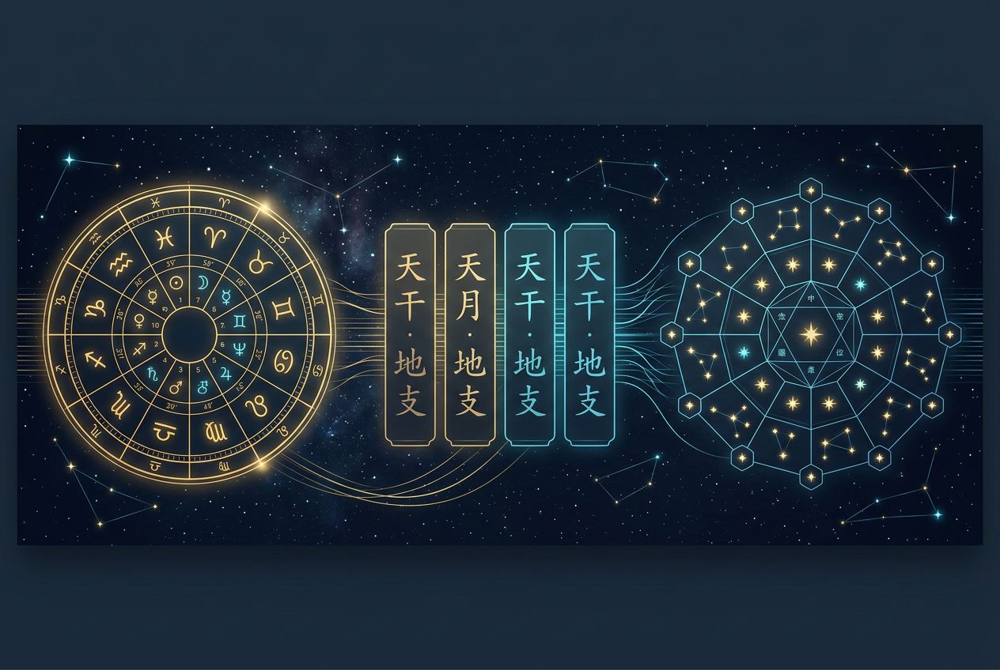
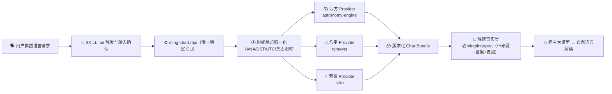

<!-- markdownlint-disable MD033 MD041 -->
<p align="center">
  
</p>

<h1 align="center">✨ ming-engine ✨</h1>

<p align="center">
  <b>一个确定性命理计算引擎</b> — 西方占星本命盘 · 四柱八字 · 紫微斗数<br/>
  <i>A deterministic, offline birth-chart engine for script-capable AI agents.</i>
</p>

<p align="center">
  
  = 22" />
  
  
  
  
</p>

---

## 🔮 这是什么？ / What is this?

**ming-engine** 把三大命理体系装进一个 **完全离线、字节级确定** 的引擎，并打包成一个可在
Qoder / Claude Code / Codex 里直接调用的 **Skill**。

> 🧠 **大模型只负责收集输入、复述确认、转达结果——它从不亲自算命。**
> 所有行星位置、宫位、相位、干支、十神、星曜、四化都由内置的确定性 CLI 计算，可回归、可复现、有来源。

| 体系     | Emoji | 能力                                                                                                                                                   |
| -------- | :---: | ------------------------------------------------------------------------------------------------------------------------------------------------------ |
| 西方占星 |  🪐   | 行星（日→冥）· 真交点 · 小行星(Chiron/谷神/智神/婚神/灶神) · 恒星黄道(Lahiri) · 宫位(Placidus/整宫/等宫/Koch/Porphyry) · 上升中天 · 相位 · 逆行 · 尊贵 |
| 四柱八字 |  🎋   | 四柱 · 藏干 · 十神(日柱显示日主) · 纳音 · 大运/起运 · 旺衰/格局/喜用神 · 刑冲合害 · 神煞 · 吉凶倾向（带古籍来源）                                      |
| 紫微斗数 |  ⭐   | 十二宫 · 主辅星+亮度 · 四化 · 大限 · 三方四正 · 流年/流月/流日/流时 运限盘                                                                             |
| 解读     |  📜   | 按主题（婚姻/财运/事业/学业…）聚合带证据/原因链/吉凶(polarity)的事实 + 结尾追问，交宿主大模型转自然语言                                                |

---

## ⚡ 一键安装 / One-line install

对你的 AI（Qoder / WorkBuddy / 豆包电脑版 / Codex）说一句：

> 帮我安装这个技能：https://raw.githubusercontent.com/Jowitt13/ming-engine/main/INSTALL.md

宿主 AI 会自动识别平台、按 [`install-manifest.json`](install-manifest.json) 下载并校验（SHA-256 + 不可变版本 tag）、以原生方式安装并自检，再一句话告诉你结果。无需终端、路径、解压或 pnpm。

- 完整排盘（四平台一致，真机已验证）：Codex / Qoder / WorkBuddy / 豆包电脑版，使用同一份预构建引擎。
- 详见 [`INSTALL.md`](INSTALL.md) 与 [`docs/INSTALL_BY_PLATFORM.md`](docs/INSTALL_BY_PLATFORM.md)；能力矩阵见 [`docs/HOST_COMPATIBILITY.md`](docs/HOST_COMPATIBILITY.md)。

> 注：安装包来自 GitHub Release `v0.1.3`（引擎 0.1.1，排盘数学与 `v0.1.0` 一致），一句话安装会按不可变 tag 自动核对 SHA-256。

---

## 🌟 为什么与众不同 / Why it's different

- 🛡️ **不虚构（no fabrication）** — 未实现或缺输入的部分只发**警告**，绝不编造。未知时间不伪造上升/宫位；缺性别不硬凑紫微盘。
- 🔒 **完全离线 + 确定性** — 星历（astronomy-engine·VSOP87+NOVAS）、时区（IANA）、历法全部内置。相同输入 + 相同版本 → **字节级一致**的 canonical JSON。
- 📚 **有来源可追溯** — 八字解读引用《子平真诠》《滴天髓》《渊海子平》公版古籍；每条结论带 `ruleId + 出处`。
- 🕵️ **精度门禁（包装层一致性）** — 西方星体由 astronomy-engine（VSOP87 + NOVAS）计算；精度回归确保本包装层与其输出一致（非独立 JPL 对照）。上游宣称约 ±1′（对照 JPL Horizons）；本仓库独立 JPL Horizons 金标待补。
- 🔐 **隐私优先** — 解读事实层脱敏，不含姓名/经历/自由文本地名；不联网、不遥测。
- 🗣️ **解读输出有防火墙** — 专题报告（Channel B）交付前经 `lint-reading` 离线体检：第 1–5 部分禁命理术语与顾问黑话、禁空话与换词重复、禁越界预测（无收入 facts 不写加薪、不做群体比较、未知经历须用“如果/可能/例如”条件表达）。随 Skill 发布、可复现；为启发式文本检查，不保证宿主模型 100% 合规。
- 🧩 **可移植（需脚本执行）** — 一份 `SKILL.md` + 打包好的引擎，四个完整宿主（Codex / Qoder / WorkBuddy / 豆包电脑版）通用；宿主须具备本地脚本执行能力。

---

## 🗺️ 架构一览 / Architecture



**依赖方向铁律**：计算内核离线确定、绝不反向依赖解读层；第三方库类型不泄漏到公共契约。由 `eslint` 导入边界门禁强制执行。

---

## 🚀 快速开始 / Quick start

> 需要 **Node ≥ 22**。发布的 Skill 文件夹**自包含**（内置 `scripts/dist/engine.mjs`），无需 `npm install`、无需联网。

```bash
git clone https://github.com/Jowitt13/ming-engine.git
cd ming-engine/skills/calculate-birth-charts

# 1) 环境自检
node scripts/ming-chart.mjs doctor

# 2) 准备一个 birth-input.json（见下方示例），然后算三盘
node scripts/ming-chart.mjs calculate --input-file birth-input.json --systems all --output-file chart.json

# 3) 需要解读时，生成跨系统解读事实（带证据/原因链/吉凶/免责）
node scripts/ming-chart.mjs interpret --input-file birth-input.json --output-file interpretation.json
# （注：render 生成 HTML/SVG 报告的功能已暂时关闭，返回禁用提示并以退出码 3 退出）
```

<details>
<summary>📥 <b>birth-input.json 示例</b>（点击展开）</summary>

```json
{
  "calendar": "gregorian",
  "localDate": "1990-03-10",
  "localTime": "08:15:00",
  "timeAccuracy": "exact",
  "timezone": "Asia/Shanghai",
  "location": { "latitude": 30.5, "longitude": 114.3, "source": "user" },
  "ruleGender": "male",
  "settings": { "systems": ["western", "bazi", "ziwei"] }
}
```

时间未知？把 `timeAccuracy` 设为 `"unknown"` 并省略 `localTime` —— 引擎会照实降级，不伪造上升/时柱。
</details>

---

## 🧰 在各宿主里使用 / Install in your agent

### 🟣 Qoder

`SKILL.md` 是 Qoder 原生格式。将 `skills/calculate-birth-charts/` 文件夹导入 Qoder 的技能库并启用即可。
之后直接说：**“帮我排一下 1990 年 3 月 10 日早上 8 点 15，出生在武汉的盘”**。

### 🟠 Claude Code

本仓库同时是一个 **Claude Code 插件市场**（含 `.claude-plugin/marketplace.json`）：

```text
/plugin marketplace add Jowitt13/ming-engine
/plugin install calculate-birth-charts@ming-engine
```

或手动：把 `skills/calculate-birth-charts/` 复制到 `~/.claude/skills/`。

### 🟢 Codex（及任何读取 AGENTS.md 的宿主）

克隆本仓库，Codex 会读取根目录的 [`AGENTS.md`](AGENTS.md)（含运行规则与 CLI 用法）。
Skill 的 UI 元数据在 [`skills/calculate-birth-charts/agents/openai.yaml`](skills/calculate-birth-charts/agents/openai.yaml)。

---

## 🛠️ CLI 速查 / Command reference

单一稳定入口：`node scripts/ming-chart.mjs <subcommand>`（参数走数组/文件，绝不拼 shell）。

| 子命令         | 作用                                                                                                                         |
| -------------- | ---------------------------------------------------------------------------------------------------------------------------- |
| `doctor`       | 环境自检：Node、平台、内置 TZDB 版本、能力清单                                                                               |
| `normalize`    | 只做时间/地点归一化（UTC instant、真太阳时、DST 消歧）                                                                       |
| `calculate`    | 计算三盘 → 版本化 `ChartBundle`（`--systems all\|western,bazi,ziwei`）                                                       |
| `compare`      | 对比流派/真太阳时等 versioned profile 的盘面差异                                                                             |
| `horoscope`    | 紫微 **运限盘**（大限/小限/流年/流月/流日/流时），`--at YYYY-MM-DD[THH:mm]`                                                  |
| `interpret`    | 跨系统**解读事实**（按主题聚合、带证据/免责），供宿主 LLM 转自然语言                                                         |
| `synastry`     | **多人合婚/关系分析**（1-5 人，八字/紫微/占星三系）；>2 人需 `analyzePair` 指定两人                                          |
| `lint-reading` | **解读体检**：对 Channel B 报告草稿做术语/空话/重复/事实边界检查（`--channel topic\|full`、`--simple`），有 error 以非零退出 |
| `render`       | **暂时关闭**（HTML/SVG 报告）——返回禁用提示并以退出码 3 退出；改用 `calculate`/`interpret` JSON                              |
| `verify`       | 用内置 fixture 自检引擎                                                                                                      |

> ✅ 成功输出 `{ "ok": true, ... }`；失败输出 `{ "ok": false, "error": { "code": ... } }` 并以稳定退出码退出。

---

## ⚠️ 边界与免责 / Scope & disclaimer

- 🎭 面向**传统文化、娱乐与自我反思**。**不是**经科学验证的预测。
- 🚫 **绝不**给出确定性的医疗、法律、投资、生死建议；健康提示仅是五行/宫位的一般结构描述。
- 🌗 西方恒星黄道(Lahiri)、真交点、小行星**已实现**；真交点/小行星为**近似精度（角分级近似）**，明确标注且不纳入 ≤1′ 门禁。
- 🧾 缺时间/性别会**照实降级**并说明原因。

---

## 🧑‍💻 开发 / Development

pnpm monorepo（`packages/*`）构建出 Skill 的引擎 bundle。

> **开发本仓库需 Node.js ≥ 24**；运行已发布的 Skill 包只需 Node.js ≥ 22（无需 pnpm/Git/源码构建）。

```bash
pnpm install          # 仅开发需要
pnpm run verify:all   # 全部强制门禁（见 docs/VALIDATION.md）
pnpm run build        # 重建 scripts/dist/engine.mjs + sbom.cdx.json（改动后请提交产物）
pnpm run package      # 生成 dist/*.zip + .sha256（自校验完整性）
```

`verify:all` 依次运行：`format:check → lint → typecheck → test → build → validate:skill →
validate:reading → validate:docs → smoke → forward:test → package:hosts → verify:hosts →
verify:install → check:doc-counts → scan:deps → scan:secrets → scan:incident`（其中 build 后还有 validate:provenance）。当前 **260 tests / 22 files 全绿**。

深入阅读：[`docs/ARCHITECTURE.md`](docs/ARCHITECTURE.md) · [`docs/VALIDATION.md`](docs/VALIDATION.md) ·
[`docs/LICENSE_AUDIT.md`](docs/LICENSE_AUDIT.md) · [`docs/PRIVACY.md`](docs/PRIVACY.md) ·
[`skills/calculate-birth-charts/SKILL.md`](skills/calculate-birth-charts/SKILL.md)

---

## 📦 依赖与许可 / Dependencies & license

引擎内联的运行时依赖全部为 **MIT**（闭源友好）：`zod` · `moment-timezone` · `tyme4ts` · `iztro` ·
`astronomy-engine`。八字解读规则引用公版古籍（《子平真诠》《滴天髓》《渊海子平》）。完整清单见
[`docs/LICENSE_AUDIT.md`](docs/LICENSE_AUDIT.md) 与 [`THIRD_PARTY_NOTICES`](skills/calculate-birth-charts/THIRD_PARTY_NOTICES.md)。

本项目以 [MIT](LICENSE) 许可发布。🌙 愿你算得开心、看得明白。
