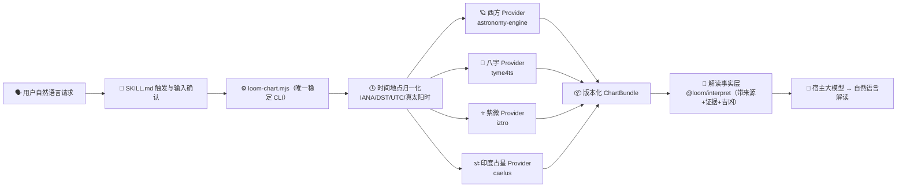
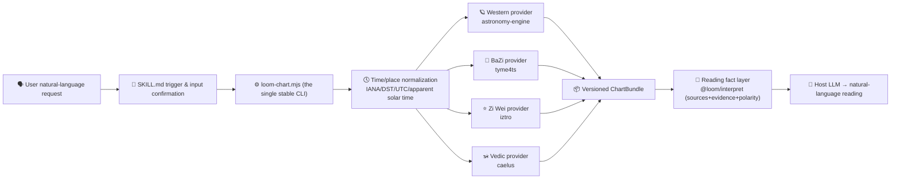

<!-- markdownlint-disable MD033 MD041 -->

<h1 align="center">✨ 璇玑玉衡 · Loom of Heaven ✨</h1>

<p align="center">
  <b>把天时、星轨与古老历法，收束为一台可复现的离线引擎</b><br/>
  西方占星本命盘 · 四柱八字 · 紫微斗数 · 印度占星<br/>
  <i>A deterministic, offline four-system birth-chart engine for script-capable AI agents.</i>
</p>

<p align="center">
  
  = 22" />
  
  
  
</p>

---

### 🔮 这是什么？

有些问题可以交给 AI，有些问题应先交给**璇玑玉衡**。**璇玑玉衡** 将四大命理体系装进一个 **完全离线、字节级确定** 的计算引擎，并打包成供支持本地执行的基础大模型以及 Agent 调用的 **Skill**。

> 🧠 **大模型负责倾听、核对与转述；不替星辰落位，也不替历法越界。**
> 所有行星位置、宫位、相位、干支、十神、星曜与四化，都由内置的确定性 CLI 计算：可回归、可复现，也有来处。

| 体系           | 能力                                                                                                   |
| -------------- | ------------------------------------------------------------------------------------------------------ |
| 西方占星       | 本命盘、行星、宫位、相位、上升/中天与逆行；支持真交点、小行星、Lahiri 恒星黄道与五种宫制                 |
| 四柱八字       | 四柱、藏干、十神、纳音、起运/大运，以及有古籍来源的旺衰、格局、喜用神、神煞与吉凶事实                   |
| 紫微斗数       | 十二宫、星曜与亮度、四化、三方四正，以及大限/小限/流年/流月/流日/流时运限盘                            |
| 印度占星（有界） | Vedic/Jyotish 本命盘、两种交点模式、全宫制、Nakshatra/Pada、Panchanga 与 D1/D9；未知时间如实降级     |
| 解读           | 按主题聚合可追溯事实，以自然、具体的叙述呈现；技术依据只在明确请求时展开                               |

### 🌒 先看结果，再看原理

以下是完全虚构、已脱敏的端到端样例。沿着同一条链路，你可以看到输入如何变成结构化计算结果，再变成有边界的主题解读：

[合成输入](examples/birth-input.json) → [四体系计算结果](examples/chart.json) → [主题解读事实](examples/interpretation.json) → [关系分析示例](examples/synastry.json)

### ✦ 适合谁用

适合需要**可复现的时间、历法与命理规则计算**，又希望由 AI 大模型自然承接输入与表达的人；也适合希望把这套能力带进 Qoder、Claude Code、Codex、WorkBuddy 或豆包电脑版的人。

### ⚡ 把它交给你的 AI

对你的 AI Agent 说一句：

> 帮我安装这个技能：https://raw.githubusercontent.com/Jowitt13/loom-of-heaven/main/INSTALL.md

AI Agent 会先辨认自己所在的平台，并读取 [`install-manifest.json`](install-manifest.json) 的 `published` 状态；**只有所选平台已发布时**，才会读取下载地址、校验 SHA-256 并安装。它不会猜测、拼接或尝试不存在的下载链接。

#### 当前可用性

| Agent       | 当前状态                                | 最简开始方式                                         |
| ----------- | --------------------------------------- | ---------------------------------------------------- |
| Codex       | 可从公开仓库使用完整排盘 Skill          | 克隆或下载本仓库后打开项目；不依赖 GitHub Release    |
| Claude Code | 可通过本仓库的插件市场安装              | 执行下方的 `/plugin` 命令                            |
| Qoder       | 已发布 GitHub Release `v0.4.0`          | 发送上方安装链接；Agent 下载、校验后安装             |
| WorkBuddy   | 已发布 GitHub Release `v0.4.0`          | 发送上方安装链接；Agent 下载、校验后按 Agent 流程导入 |
| 豆包电脑版  | 已发布 GitHub Release `v0.4.0`          | 发送上方安装链接；Agent 下载、校验后按 Agent 流程导入 |

各 Agent 的完整排盘能力与兼容性记录仍见下方文档；可下载性始终以清单的 `published` 字段为准，下载 URL 与 SHA-256 以 [`install-manifest.json`](install-manifest.json) 和 [`SHA256SUMS.txt`](SHA256SUMS.txt) 为准。

- 详见 [`INSTALL.md`](INSTALL.md) 与 [`docs/INSTALL_BY_PLATFORM.md`](docs/INSTALL_BY_PLATFORM.md)；能力矩阵见 [`docs/HOST_COMPATIBILITY.md`](docs/HOST_COMPATIBILITY.md)。

### 🌟 有什么不同之处

- 🛡️ **不把未知写成命定** — 未实现或缺输入的部分只发**警告**，绝不编造。未知时间不伪造上升/宫位；缺性别不硬凑紫微盘。
- 🔒 **同一刻，回到同一张盘** — 星历（astronomy-engine·VSOP87+NOVAS）、时区（IANA）与历法全部内置。相同输入 + 相同版本 → **字节级一致**的 canonical JSON。
- 📚 **每一条解释，都留着来处** — 八字解读引用《子平真诠》《滴天髓》《渊海子平》等公版古籍；每条结论在引擎内部保留规则与出处链，明确要求时才展开技术依据。
- 🕵️ **先校准，再开口** — 西方主星体与五种宫制均经独立 JPL Horizons／Swiss Ephemeris 金标交叉校验，覆盖范围和例外见 [`docs/VALIDATION.md`](docs/VALIDATION.md)；真交点与小行星为 approximate 级别，不受此门禁约束。
- 🔐 **把私密留在本地** — 解读事实层脱敏，不含姓名/经历/自由文本地名；不联网、不遥测。
- 🗣️ **让语言有边界** — 专业术语可以出现，但会紧接规则机制、现实含义和适用条件；默认不附原始 ID、来源面板、警告区块、固定声明或追问菜单。`lint-reading` 离线检查空话、重复、越界预测和这类默认交付泄漏；它是可复现的启发式检查，不保证宿主模型 100% 合规。
- 🧩 **一份 Skill，随行而用** — 一份 `SKILL.md` + 打包好的引擎，所有主流 Agent 通用。

> 使用前提：Agent 需要具备本地脚本执行能力。

<details>
<summary>🗺️ <b>从一句话，到一份可复现的结果</b></summary>

<br/>



**依赖方向铁律**：计算内核离线确定、绝不反向依赖解读层；第三方库类型不泄漏到公共契约。由 `eslint` 导入边界门禁强制执行。

</details>

### 🚀 快速开始

> 需要 **Node ≥ 22**。发布的 Skill 文件夹**自包含**（内置 `scripts/dist/engine.mjs`），无需 `npm install`、无需联网。

```bash
git clone https://github.com/Jowitt13/loom-of-heaven.git
cd loom-of-heaven/skills/xuan-ji-yu-heng

# 1) 环境自检
node scripts/loom-chart.mjs doctor

# 2) 准备一个 birth-input.json（见下方示例），然后计算四体系命盘
node scripts/loom-chart.mjs calculate --input-file birth-input.json --systems all --output-file chart.json

# 3) 需要解读时，生成跨体系解读事实，供宿主按阅读规范组织答案
node scripts/loom-chart.mjs interpret --input-file birth-input.json --output-file interpretation.json
# （注：render 生成 HTML/SVG 报告的功能已暂时关闭，返回禁用提示并以退出码 3 退出）
```

<details>
<summary>📥 <b>birth-input.json 示例</b>（点击展开）</summary>

> **合成示例：** 下列人物、日期、时间与地点仅用于测试和演示，不对应真实个人。

```json
{
  "calendar": "gregorian",
  "localDate": "1990-03-10",
  "localTime": "08:15:00",
  "timeAccuracy": "exact",
  "timezone": "Asia/Shanghai",
  "location": { "latitude": 30.5, "longitude": 114.3, "source": "user" },
  "ruleGender": "male"
}
```

不写 `settings.systems` 时默认计算西方占星、八字、紫微和印度占星四体系；也可用 `--systems western,bazi,ziwei,vedic` 选择所需子集。时间未知？把 `timeAccuracy` 设为 `"unknown"` 并省略 `localTime` —— 引擎会照实降级，不伪造上升/时柱。
</details>

### 📜 阅读呈现

默认回答围绕你的问题写成连续、具体的叙述：需要使用专业术语时，术语会紧接其规则机制、现实含义和适用条件。不会默认附上原始 fact／rule ID、来源面板、警告代码、固定声明或追问菜单；需要计算细节、盘面依据或来源时可明确提出。完整约定见 [`docs/NARRATIVE_OUTPUT_V1.md`](docs/NARRATIVE_OUTPUT_V1.md)。

### 🛠️ 常用命令

单一稳定入口：`node scripts/loom-chart.mjs <subcommand>`（参数走数组/文件，绝不拼 shell）。完整命令与输出契约见 [`SKILL.md`](skills/xuan-ji-yu-heng/SKILL.md)。

| 子命令         | 作用                                                                                                                             |
| -------------- | -------------------------------------------------------------------------------------------------------------------------------- |
| `doctor`       | 环境自检：Node、平台、内置 TZDB 版本、能力清单                                                                                   |
| `calculate`    | 计算四体系命盘 → 版本化 `ChartBundle`（`--systems all\|western,bazi,ziwei,vedic`）                                               |
| `interpret`    | 跨体系**解读事实**（按主题聚合、保留规则与限制链），供宿主按阅读规范组织自然语言答案                                             |
| `answer-plan`  | 普通主题问题的入口：计算四体系后，只返回当前主题允许使用的脱敏事实与叙述计划                                                     |
| `version`      | 读取已安装包的真实版本与迁移状态，不猜测线上最新版本                                                                             |
| `verify`       | 用内置 fixture 自检引擎                                                                                                          |

> ✅ 成功输出 `{ "ok": true, ... }`；失败输出 `{ "ok": false, "error": { "code": ... } }` 并以稳定退出码退出。

> `render` 目前暂停；需要结构化结果时使用 `calculate` / `interpret` JSON。流派对比、运限、关系分析、文本门禁与迁移命令均保留在完整命令文档中。

### ⚠️ 边界与免责

- 🎭 面向**传统文化、娱乐与自我反思**。**不是**经科学验证的预测。
- 🚫 **绝不**给出确定性的医疗、法律、投资、生死建议；健康提示仅是五行/宫位的一般结构描述。
- 🌗 西方恒星黄道(Lahiri)、真交点、小行星**已实现**；真交点/小行星为**近似精度（角分级近似）**，明确标注且不纳入 ≤1′ 门禁。
- 🧾 缺时间/性别会**照实降级**并说明原因。

### 🧑‍💻 开发

pnpm monorepo（`packages/*`）构建出 Skill 的引擎 bundle。

> **开发本仓库需 Node.js ≥ 24**；运行已发布的 Skill 包只需 Node.js ≥ 22（无需 pnpm/Git/源码构建）。

```bash
pnpm install          # 仅开发需要
pnpm run verify:cloud # GitHub Actions 使用的非敏感门禁
pnpm run build        # 重建 scripts/dist/engine.mjs + sbom.cdx.json（改动后请提交产物）
```

完整门禁、受控本地扫描和发布流程见 [`docs/VALIDATION.md`](docs/VALIDATION.md) 与 [`docs/RELEASE_CHECKLIST.md`](docs/RELEASE_CHECKLIST.md)。进一步阅读：[`docs/ARCHITECTURE.md`](docs/ARCHITECTURE.md) · [`docs/LICENSE_AUDIT.md`](docs/LICENSE_AUDIT.md) · [`docs/PRIVACY.md`](docs/PRIVACY.md) · [`skills/xuan-ji-yu-heng/SKILL.md`](skills/xuan-ji-yu-heng/SKILL.md)。

### 📦 依赖与许可

引擎内联的运行时依赖全部为 **MIT**（闭源友好）：`zod` · `moment-timezone` · `tyme4ts` · `iztro` ·
`astronomy-engine`。八字解读规则引用公版古籍（《子平真诠》《滴天髓》《渊海子平》）。完整清单见
[`docs/LICENSE_AUDIT.md`](docs/LICENSE_AUDIT.md) 与 [`THIRD_PARTY_NOTICES`](skills/xuan-ji-yu-heng/THIRD_PARTY_NOTICES.md)。

本项目以 [MIT](LICENSE) 许可发布。🌙 愿你算得开心、看得明白。

---

### 🔮 What is this?

**loom-of-heaven** packs four birth-chart systems into a **fully offline, byte-level deterministic** engine, shipped as a **Skill** for script-capable AI hosts.

> 🧠 **The LLM only gathers inputs, relays confirmations and narrates results — it never computes charts itself.**
> Every planet position, house, aspect, ganzhi, ten-god, star and si-hua is computed by the bundled deterministic CLI: regression-tested, reproducible and sourced.

| System            | Capabilities                                                                                                                                                                                                                                                                                                                                                                                            |
| ----------------- | ------------------------------------------------------------------------------------------------------------------------------------------------------------------------------------------------------------------------------------------------------------------------------------------------------------------------------------------------------------------------------------------------------- |
| Western natal     | Planets (Sun→Pluto) · true nodes · asteroids (Chiron/Ceres/Pallas/Juno/Vesta) · sidereal zodiac (Lahiri) · houses (Placidus/Whole/Equal/Koch/Porphyry) · Asc/MC · aspects · retrogrades · dignities                                                                                                                                                                                                     |
| Four Pillars/BaZi | Four pillars · hidden stems · ten gods (day-master shown on day pillar) · nayin · luck pillars/onset · strength/pattern/favorable elements · punishments/clashes/harmonies/harms · shen-sha · fortune leanings (with classical sources)                                                                                                                                                                 |
| Zi Wei Dou Shu    | Twelve palaces · major/minor stars + brightness · si-hua · major limits · san-fang-si-zheng · yearly/monthly/daily/hourly transit charts                                                                                                                                                                                                                                                                |
| Vedic/Jyotish     | Vedic natal chart · sidereal zodiac · Rahu/Ketu default to the mean-node convention (both mean and true modes reported) · time-of-day fields suppressed with `VEDIC_TIME_REQUIRED` when birth time is unknown · offline MIT provider; the "high" precision claim is limited to the covered **Swiss-only external numeric reference** fixture (<=1 arc-minute), not a general astrometric accuracy claim |
| Reading           | Topic-based (marriage/wealth/career/study…) traceable facts, delivered as natural, specific prose by default; technical evidence is expanded only on request                                                                                                                                                                                                                                            |

### ⚡ Install entry

Just say this to your AI agent:

> Install this skill for me: https://raw.githubusercontent.com/Jowitt13/loom-of-heaven/main/INSTALL.md

The AI Agent first detects the platform and reads the `published` status in [`install-manifest.json`](install-manifest.json); **only when the chosen platform is published** does it read the download URL, verify the SHA-256 and install. It never guesses, stitches together or tries download links that do not exist.

#### Availability

| Agent          | Current status                                         | Easiest way to start                                                                      |
| -------------- | ------------------------------------------------------ | ----------------------------------------------------------------------------------------- |
| Codex          | Full charting Skill usable from the public repo        | Clone or download this repo and open the project; no GitHub Release needed                |
| Claude Code    | Available through this repository's plugin marketplace | Run the `/plugin` commands below                                                          |
| Qoder          | Published on GitHub Release `v0.4.0`                   | Send the install link above; the Agent downloads, verifies and installs                   |
| WorkBuddy      | Published on GitHub Release `v0.4.0`                   | Send the install link above; the Agent downloads, verifies and imports via the Agent flow |
| Doubao desktop | Published on GitHub Release `v0.4.0`                   | Send the install link above; the Agent downloads, verifies and imports via the Agent flow |

The full charting capability and real-device compatibility records for all four platforms are documented below; downloadability always follows the manifest's `published` field. Download URLs and SHA-256 hashes are authoritative in [`install-manifest.json`](install-manifest.json) and [`SHA256SUMS.txt`](SHA256SUMS.txt).

- See [`INSTALL.md`](INSTALL.md) and [`docs/INSTALL_BY_PLATFORM.md`](docs/INSTALL_BY_PLATFORM.md); capability matrix in [`docs/HOST_COMPATIBILITY.md`](docs/HOST_COMPATIBILITY.md).

### 🌟 What makes it different?

- 🛡️ **No fabrication** — parts that are unimplemented or missing inputs only emit **warnings**, never inventions. Unknown birth time never fakes Ascendant/houses; missing gender never forces a Zi Wei chart.
- 🔒 **Fully offline + deterministic** — ephemeris (astronomy-engine·VSOP87+NOVAS), timezones (IANA) and calendars are all bundled. Same input + same version → **byte-identical** canonical JSON.
- 📚 **Traceable sources** — BaZi readings cite the public-domain classics 《子平真诠》《滴天髓》《渊海子平》 and related works; the engine retains a rule-and-source chain for every conclusion, expanded only when explicitly requested.
- 🕵️ **Precision gates (two independent layers)** — Western primary bodies and five house systems are cross-checked against independent JPL Horizons/Swiss Ephemeris goldens. Coverage and exceptions are in [`docs/VALIDATION.md`](docs/VALIDATION.md); true nodes and asteroids remain approximate and are outside this gate.
- 🔐 **Privacy first** — the reading fact layer is de-identified: no names/biographies/free-text place names; no network, no telemetry.
- 🗣️ **A firewall over reading output** — professional terms may appear, but sit next to their mechanism, practical implication and relevant condition. By default there are no raw IDs, source panels, warning blocks, fixed declarations or follow-up menus. The offline `lint-reading` check catches empty talk, repetition, out-of-bounds predictions and this kind of default-delivery leakage; it is reproducible but cannot guarantee 100% host-model compliance.
- 🧩 **One Skill, ready to travel** — one `SKILL.md` + packaged engine works across mainstream AI agents.

> Prerequisite: the Agent must support local script execution.

### 🗺️ Architecture



**Iron law of dependency direction**: the computation kernel is offline-deterministic and never depends back on the reading layer; third-party library types never leak into the public contract. Enforced by `eslint` import-boundary gates.

### 🚀 Quick start

> Requires **Node ≥ 22**. The published Skill folder is **self-contained** (ships `scripts/dist/engine.mjs`); no `npm install`, no network.

```bash
git clone https://github.com/Jowitt13/loom-of-heaven.git
cd loom-of-heaven/skills/xuan-ji-yu-heng

# 1) Environment self-check
node scripts/loom-chart.mjs doctor

# 2) Prepare a birth-input.json (see the example below), then compute all four chart systems
node scripts/loom-chart.mjs calculate --input-file birth-input.json --systems all --output-file chart.json

# 3) When a reading is needed, generate cross-system facts for the host to organize under the reading contract
node scripts/loom-chart.mjs interpret --input-file birth-input.json --output-file interpretation.json
# (Note: the render command for HTML/SVG reports is temporarily disabled; it returns a disabled notice and exits with code 3)
```

<details>
<summary>📥 <b>birth-input.json example</b> (click to expand)</summary>

> **Synthetic example:** the person, date, time and place below are for testing and demonstration only and do not correspond to any real individual.

```json
{
  "calendar": "gregorian",
  "localDate": "1990-03-10",
  "localTime": "08:15:00",
  "timeAccuracy": "exact",
  "timezone": "Asia/Shanghai",
  "location": { "latitude": 30.5, "longitude": 114.3, "source": "user" },
  "ruleGender": "male"
}
```

Omitting `settings.systems` computes Western, BaZi, Zi Wei and Vedic by default; use `--systems western,bazi,ziwei,vedic` to select a subset. Unknown birth time? Set `timeAccuracy` to `"unknown"` and omit `localTime` — the engine degrades honestly and never fakes the Ascendant/hour pillar.
</details>

### 📜 Reading delivery

The default answer is continuous, specific prose about the user's question. When a professional term is useful, its rule mechanism, practical implication and relevant condition sit next to it. Raw fact/rule IDs, source panels, warning codes, fixed declarations and follow-up menus are not shown by default; ask explicitly for calculation details, chart evidence or sources. The full contract is in [`docs/NARRATIVE_OUTPUT_V1.md`](docs/NARRATIVE_OUTPUT_V1.md).

### 🛠️ Command reference

Single stable entry: `node scripts/loom-chart.mjs <subcommand>` (arguments via arrays/files, never shell string assembly).

| Subcommand     | Purpose                                                                                                                                                                                       |
| -------------- | --------------------------------------------------------------------------------------------------------------------------------------------------------------------------------------------- |
| `doctor`       | Environment self-check: Node, platform, bundled TZDB version, capability list                                                                                                                 |
| `normalize`    | Time/place normalization only (UTC instant, apparent solar time, DST disambiguation)                                                                                                          |
| `calculate`    | Compute all four chart systems → versioned `ChartBundle` (`--systems all\|western,bazi,ziwei,vedic`)                                                                                          |
| `compare`      | Compare chart differences across school/true-solar-time versioned profiles                                                                                                                    |
| `horoscope`    | Zi Wei **transit charts** (major limit/minor limit/yearly/monthly/daily/hourly), `--at YYYY-MM-DD[THH:mm]`                                                                                    |
| `interpret`    | Cross-system **reading facts** (topic-aggregated, with rule and limitation chains), for the host to organize under the reading contract                                                       |
| `synastry`     | **Multi-person compatibility/relationship analysis** (1–5 people, BaZi/Zi Wei/astrology); >2 people requires `analyzePair` naming two                                                         |
| `lint-reading` | **Reading check-up**: checks terms detached from mechanism, empty talk, repetition, fact boundaries and default-delivery leakage (`--channel topic\|full`, `--simple`, `--technical-details`) |
| `render`       | **Temporarily disabled** (HTML/SVG reports) — returns a disabled notice and exits with code 3; use `calculate`/`interpret` JSON instead                                                       |
| `verify`       | Engine self-check with bundled fixtures                                                                                                                                                       |

> ✅ Success outputs `{ "ok": true, ... }`; failure outputs `{ "ok": false, "error": { "code": ... } }` and exits with a stable exit code.

### ⚠️ Scope & disclaimer

- 🎭 For **traditional culture, entertainment and self-reflection**. **Not** scientifically validated prediction.
- 🚫 **Never** gives deterministic medical, legal, investment or life-and-death advice; health notes are only general five-element/palace structural descriptions.
- 🌗 Western sidereal zodiac (Lahiri), true nodes and asteroids are **implemented**; true nodes/asteroids are at **approximate precision (arc-minute-level approximation)**, clearly labeled and excluded from the ≤1′ gate.
- 🧾 Missing time/gender **degrades honestly** with the reason stated.

### 🧑‍💻 Development

A pnpm monorepo (`packages/*`) builds the Skill's engine bundle.

> **Developing this repo requires Node.js ≥ 24**; running the published Skill package only needs Node.js ≥ 22 (no pnpm/Git/source build).

```bash
pnpm install          # development only
pnpm run verify:cloud # the non-sensitive gate used by GitHub Actions
pnpm run build        # rebuild scripts/dist/engine.mjs + sbom.cdx.json (commit the artifacts after changes)
```

For the complete gate sequence, controlled local scans and release process, see [`docs/VALIDATION.md`](docs/VALIDATION.md) and [`docs/RELEASE_CHECKLIST.md`](docs/RELEASE_CHECKLIST.md). Further reading: [`docs/ARCHITECTURE.md`](docs/ARCHITECTURE.md) · [`docs/LICENSE_AUDIT.md`](docs/LICENSE_AUDIT.md) · [`docs/PRIVACY.md`](docs/PRIVACY.md) · [`skills/xuan-ji-yu-heng/SKILL.md`](skills/xuan-ji-yu-heng/SKILL.md).

### 📦 Dependencies & license

All runtime dependencies inlined into the engine are **MIT** (closed-source friendly): `zod` · `moment-timezone` · `tyme4ts` · `iztro` ·
`astronomy-engine`. BaZi reading rules cite public-domain classics (《子平真诠》《滴天髓》《渊海子平》). The full list is in
[`docs/LICENSE_AUDIT.md`](docs/LICENSE_AUDIT.md) and [`THIRD_PARTY_NOTICES`](skills/xuan-ji-yu-heng/THIRD_PARTY_NOTICES.md).

This project is released under the [MIT](LICENSE) license. 🌙 May you compute with joy and read with clarity.
